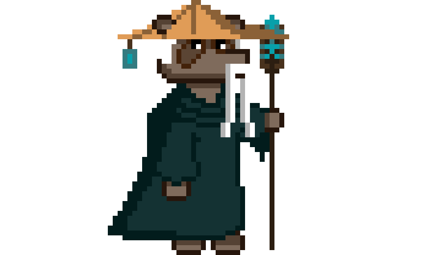
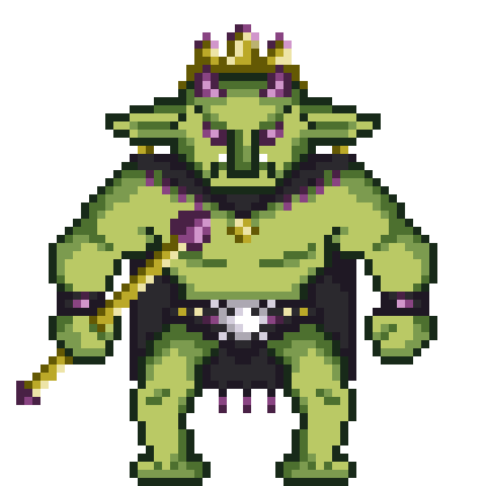

# Tanu's Quest

## Sommaire
1. [Introduction](#introduction)
2. [Installation](#installation)
3. [Compatibilité](#compatibilité)
4. [Utilisation](#utilisation)
5. [Technologies Utilisées](#technologies-utilisées)
6. [Équipe](#équipe)
7. [Personnages](#personnages)
8. [Photos du Jeu](#photos-du-jeu)

## Introduction
Bienvenue dans **Tanu's Quest**! Ce jeu a été entièrement développé from scratch par **ALKH Studio**, une petite équipe passionnée avec de grands projets. Nous nous efforçons de créer des expériences de jeu uniques et mémorables.

Nous avons consacré six mois, du 1er janvier au 30 mai, à développer ce jeu 2D avec aucune connaissance préalable en développement de jeux. Nous avons uniquement utilisé du code et des assets graphiques, sans recourir à un moteur de jeu.

## Installation
Pour installer et lancer le jeu, suivez les étapes suivantes :

1. Installez **Visual Studio Code** (VSCode) depuis [ce lien](https://code.visualstudio.com/).
2. Ouvrez VSCode et installez les extensions **Live Server** et **p5.js**.
3. Clonez ce dépôt sur votre machine locale.
4. Ouvrez le fichier `index.html` dans VSCode.
5. Faites un clic droit sur `index.html` et sélectionnez **Open with Live Server**.

## Compatibilité
Le jeu est compatible avec **Windows** et est optimisé pour une résolution d'écran de **1920x1080p**. Pour une expérience optimale, appuyez sur **F11** pour passer en mode plein écran.

## Utilisation
Une fois le serveur en direct lancé via Live Server :
1. Assurez-vous que votre résolution d'écran est définie sur 1920x1080p pour une qualité maximale.
2. Appuyez sur **F11** pour passer en mode plein écran et profiter pleinement du jeu.

## Technologies Utilisées
Ce projet a été réalisé en utilisant les technologies suivantes :
 

## Équipe
Nous sommes **ALKH Studio**, une petite équipe avec de grands projets. Nous sommes des passionnés qui s'efforcent de créer des expériences de jeu uniques et mémorables.

### Membres de l'équipe :
- **Aurélia** (Designer)
  
- **Liséa** (Designer)
  
- **Kévin** (Designer)
  
- **Hugo** (Développeur)
  

## Personnages
Découvrez les personnages fascinants de **Tanu's Quest** :

- **Le Grand Sage**
  
  Le Grand Sage est un guide spirituel et une source de sagesse pour Tanu. Il possède une connaissance approfondie de l'histoire et des mystères du monde.

- **L'Alchimiste**
  
  L'Alchimiste est un mystérieux inventeur qui aide Tanu en lui fournissant des potions magiques et des artefacts pour l'aider dans sa quête.

- **Tanu**
  
  Tanu est le protagoniste du jeu, un jeune aventurier intrépide en quête de vérité et de justice. Il est courageux et déterminé à sauver son monde.

- **Le Yéti**
  
  Le Yéti est une créature mythique des montagnes enneigées, à la fois redoutable et protectrice. Tanu devra négocier avec lui pour avancer dans sa quête.

- **Le Gobelin**
  
  Le Gobelin est un farceur malicieux qui aime jouer des tours aux voyageurs imprudents. Il peut être un allié surprenant ou un adversaire redoutable pour Tanu.

## Photos du Jeu
Insérez ici des photos du jeu pour donner un aperçu de son apparence et de son gameplay.

---

Merci d'avoir joué à **Tanu's Quest**! Profitez bien et n'hésitez pas à partager vos retours.
