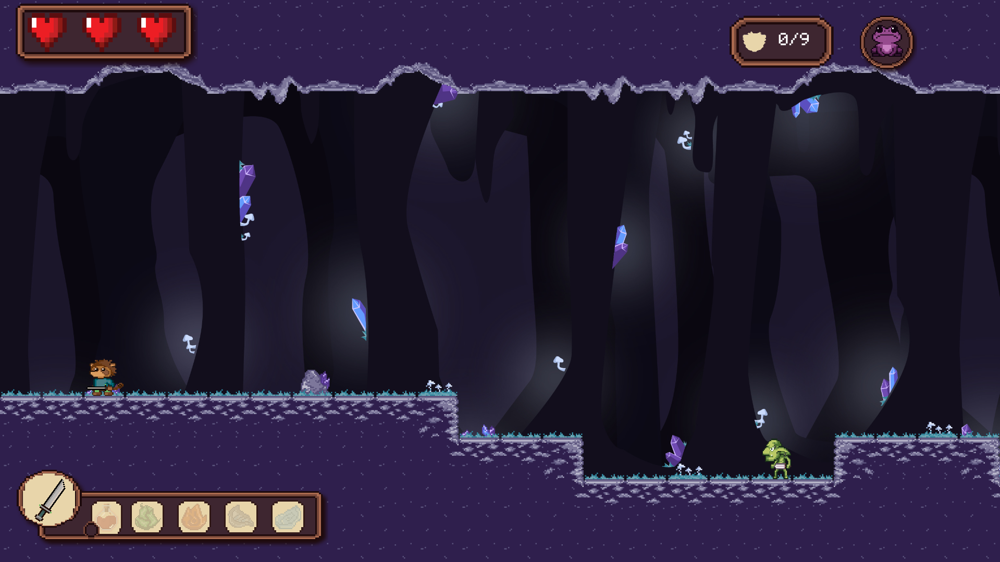

<h1 align="center">Tanu's Quest</h1>

  

## Sommaire
1. [Introduction](#introduction)
2. [Installation](#installation)
3. [Utilisation](#utilisation)
4. [Technologies Utilisées](#technologies-utilisées)
5. [Équipe](#équipe)
6. [Personnages](#personnages)
7. [Photos du Jeu](#photos-du-jeu)

## Introduction
Bienvenue dans **Tanu's Quest**! Ce jeu a été entièrement développé from scratch par **ALKH Studio**.

Nous avons consacré six mois, du 1er janvier au 30 mai, à développer ce jeu 2D avec aucune connaissance préalable en développement de jeux. Nous avons uniquement utilisé du code et des assets graphiques, sans recourir à un moteur de jeu.

## Installation
Pour installer et lancer le jeu, suivez les étapes suivantes :

1. Installez **Visual Studio Code** (VSCode) depuis [ce lien](https://code.visualstudio.com/).
2. Ouvrez VSCode et installez les extensions **Live Server** et **p5.js**.
3. Clonez ce dépôt sur votre machine locale.
4. Ouvrez le fichier `index.html` dans VSCode.
5. Faites un clic droit sur `index.html` et sélectionnez **Open with Live Server**.

## Utilisation
Une fois le serveur en direct lancé via Live Server :
1. Assurez-vous d'avoir un PC sous Windows pour une expériences optimal.
2. Lancer le jeu soit sur Google Crome ou Opera GX.
3. Assurez-vous que votre résolution d'écran est définie sur 1920x1080p pour une qualité maximale.
4. Appuyez sur **F11** pour passer en mode plein écran et profiter pleinement du jeu.

## Technologies Utilisées
Ce projet a été réalisé en utilisant les technologies suivantes :

   

## Équipe
Nous sommes **ALKH Studio**, une petite équipe avec de grands projets. Nous sommes des passionnés qui s'efforçent de créer des expériences de jeu uniques et mémorables.

  

### Membres de l'équipe :
- **Aurélia** (Designer)
  

    
  

- **Liséa** (Designer)
  

    
  

- **Kévin** (Designer)
  

    
  

- **Hugo** (Développeur)
  

    
  

## Personnages
Découvrez les personnages fascinants de **Tanu's Quest** :

  
  
  
  
  

## Photos du Jeu

Profitez bien et n'hésitez pas à partager vos retours.
